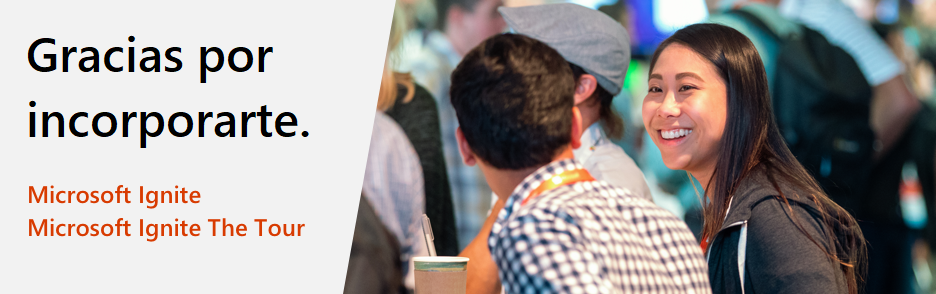

# Microsoft Ignite and Microsoft Ignite The Tour: Oferta de examen de certificación gratuita

Gracias por asistir a Microsoft Ignite 2019 o un evento de Microsoft Ignite The Tour 2019-2020. Todos los participantes recibirán un examen de certificación gratuito, sujeto a ciertas excepciones, *para ayudarle a seguir mejorando y demostrar su experiencia técnica a empleadores y colegas.

## Detalles de la oferta

Si asistió a Microsoft Ignite 2019 o un evento de Microsoft Ignite The Tour 2019-2020, puede participar para recibir un examen gratuito de certificación de fundamentos, roles o especialidad de Microsoft. La oferta de examen gratuito está disponible para canjear desde el comienzo del evento al que asiste y es válida durante 180 días después del último día del evento. Si no programa un examen dentro de ese plazo, no podrá canjear su oferta.  

##  Cómo reclamar su examen gratis

Dado que esta es una oferta digital, le pedimos que verifique su asistencia al evento mediante la misma cuenta social utilizada para registrarse (ver paso 7 a continuación) al momento de programar su examen en línea. Si se registró como grupo, asegúrese de haber completado el perfil de su registro a eventos. Para asistentes de MS Ignite 2019, diríjase a [https://register.ignite.microsoft.com/](https://register.ignite.microsoft.com/); para asistentes al The Tour, diríjase a [https://register.msignite-the-tour.microsoft.com/](https://register.msignite-the-tour.microsoft.com/)Nombre de la ciudad, por ejemplo [https://register.msignite-the-tour.microsoft.com/london](https://register.msignite-the-tour.microsoft.com/london) para completar su perfil de evento.

Para realizar capturas paso a paso, [ver aquí](https://query.prod.cms.rt.microsoft.com/cms/api/am/binary/RE4i3R4).

***Para registrarse para un examen gratuito:***

1. Seleccione cualquiera de los exámenes de acreditación que se enumeran a continuación.
2. Una vez que haya accedido a la página de detalles del examen deseado, haga clic en el botón "Programar examen" para comenzar el proceso de registro en línea.
3. Inicie sesión con la cuenta de Microsoft asociada con su perfil de Microsoft Certification.  Si no tiene un perfil de Microsoft Certification, será necesario que cree uno.
4. Una vez que inicie sesión en Microsoft Certification Profile, confirme que los detalles en su Perfil de certificación son precisos.
5. Haga clic en el botón guardar y continuar ubicado en la parte inferior de la página Perfil de certificación para ir a la página "Descuentos de examen".
6. En la página "Descuentos de examen", seleccione el evento al que ha asistido y haga clic en el botón "Verificar cuenta".
7. Cuando verifica su cuenta, debe autenticarla con la misma cuenta social utilizada para registrarse en el evento (NOTA: Si utilizó una cuenta de Microsoft para registrarse en el evento, debe usar la misma cuenta de Microsoft para iniciar sesión en su Perfil de Certificación para programar su examen. Si esta acción genera dos Perfiles de certificación, comuníquese con [foros de soporte de Microsoft Certification](https://trainingsupport.microsoft.com/es-es/mcp/forum?sort=LastReplyDate&dir=Desc&tab=All&status=all&mod=&modAge=&advFil=&postedAfter=&postedBefore=&threadType=All&isFilterExpanded=false&page=1) para combinar sus perfiles después de completar su examen de certificación.)
8. Siga los pasos en las siguientes pantallas y proporcione los detalles requeridos para programar su examen.
9. Cuando realice el pago, verifique que el monto total adeudado es $0.00 y envíe el pedido.  Nota: La página 'Mi pedido' debe mostrar el siguiente descuento en la parte inferior de la página:  ***Microsoft Ignite 2019-2020 100% de descuento***.  Las páginas anteriores en el flujo de programación del examen mostrarán el precio completo.

***Soporte de certificación:***

Para problemas al programar su examen, obtenga ayuda a través de [foros de soporte de Microsoft Certification](https://trainingsupport.microsoft.com/es-es/mcp/forum?sort=LastReplyDate&dir=Desc&tab=All&status=all&mod=&modAge=&advFil=&postedAfter=&postedBefore=&threadType=All&isFilterExpanded=false&page=1). Un moderador de foro responderá en el trascurso de un día hábil.

##  Exámenes elegibles para esta oferta

Esta oferta incluye todos los exámenes de certificación de fundamentos, roles y especialidades de Microsoft. Los exámenes elegibles se enumeran a continuación.

| Por Producto | Exámenes |
| --- | --- |
| Azure | [AI-100: Designing and Implementing an Azure AI Solution](/learn/certifications/exams/ai-100) [AZ-103: Microsoft Azure Administrator](/learn/certifications/exams/az-103) [AZ-120: Planning and Administering Microsoft Azure for SAP Workloads](/learn/certifications/exams/az-120) [AZ-203: Developing Solutions for Microsoft Azure](/learn/certifications/exams/az-203) [AZ-204: Developing Solutions for Microsoft Azure (nueva versión)](/learn/certifications/exams/az-204) [AZ-220: Microsoft Azure IoT Developer](/learn/certifications/exams/az-220) [AZ-300: Microsoft Azure Architect Technologies](/learn/certifications/exams/az-300) [AZ-301: Microsoft Azure Architect Design](/learn/certifications/exams/az-301) [AZ-400: Microsoft Azure DevOps Solutions](/learn/certifications/exams/az-400) [AZ-500: Microsoft Azure Security Technologies](/learn/certifications/exams/az-500) [AZ-900: Microsoft Azure Fundamentals](/learn/certifications/exams/az-900) [DP-100: Designing and Implementing a Data Science Solution on Azure](/learn/certifications/exams/dp-100) [DP-200: Implementing an Azure Data Solution](/learn/certifications/exams/dp-200) [DP-201: Designing an Azure Data Solution](/learn/certifications/exams/dp-201)  |
| Dynamics 365 and Power Platform | [MB-200: Microsoft Power Platform + Dynamics 365 Core](/learn/certifications/exams/mb-200) [MB-210: Microsoft Dynamics 365 Sales](/learn/certifications/exams/mb-210) [MB-220: Microsoft Dynamics 365 Marketing](/learn/certifications/exams/mb-220) [MB-230: Microsoft Dynamics 365 Customer Service](/learn/certifications/exams/mb-230) [MB-240: Microsoft Dynamics 365 Field Service](/learn/certifications/exams/mb-240) [MB-300: Microsoft Dynamics 365: Core Finance and Operations](/learn/certifications/exams/mb-300) [MB-310: Microsoft Dynamics 365 Finance](/learn/certifications/exams/mb-310) [MB-320: Microsoft Dynamics 365 Supply Chain Management, Manufacturing](/learn/certifications/exams/mb-320) [MB-330: Microsoft Dynamics 365 Supply Chain Management](/learn/certifications/exams/mb-330) [MB-400: Microsoft PowerApps + Dynamics 365 Developer](/learn/certifications/exams/mb-400) [MB-500: Microsoft Dynamics 365: Finance and Operations Apps Developer](/learn/certifications/exams/mb-500) [MB-600: Microsoft Power Platform + Dynamics 365 Solution Architect](/learn/certifications/exams/mb-600) [MB-700: Microsoft Dynamics 365: Finance and Operations Apps Solution Architect](/learn/certifications/exams/mb-700) [MB-901: Microsoft Dynamics 365 Fundamentals](/learn/certifications/exams/mb-901)  [PL-900: Microsoft Power Platform Fundamentals](/learn/certifications/exams/pl-900)|
| Microsoft 365 | [MD-100: Windows 10](/learn/certifications/exams/md-100) [MD-101: Managing Modern Desktops](/learn/certifications/exams/md-101) [MS-100: Microsoft 365 Identity and Services](/learn/certifications/exams/ms-100) [MS-101: Microsoft 365 Mobility and Security](/learn/certifications/exams/ms-101) [MS-200: Planning and Configuring a Messaging Platform](/learn/certifications/exams/ms-200) [MS-201: Implementing a Hybrid and Secure Messaging Platform](/learn/certifications/exams/ms-201) [MS-300: Deploying Microsoft 365 Teamwork](/learn/certifications/exams/ms-300) [MS-301: Deploying SharePoint Server Hybrid](/learn/certifications/exams/ms-301) [MS-500: Microsoft 365 Security Administration](/learn/certifications/exams/ms-500) [MS-600: Building Applications and Solutions with Microsoft 365 Core Services](/learn/certifications/exams/ms-600) [MS-700: Managing Microsoft Teams](/learn/certifications/exams/ms-700) [MS-900: Microsoft 365 Fundamentals](/learn/certifications/exams/ms-900) |

## Términos y condiciones

- Esta oferta de examen está disponible para los usuarios que reúnen los requisitos que asistieron a Microsoft Ignite 2019 o un evento de Microsoft Ignite The Tour 2019-2020.
- Esta oferta de examen puede canjearse para tomar un (1) examen de Microsoft Certification, entregado en un centro de pruebas autorizado de Pearson Vue o a través de un sitio de supervisión en línea de Pearson Vue.
- Esta oferta de examen es específica del examen y solo se puede canjear por exámenes de Microsoft seleccionados.
- Esta oferta de examen está disponible por un período que comienza el primer día del evento en el que recibió esta oferta de examen y vence 180 días después del último día de dicho evento.
- Esta oferta de examen le da derecho a registrarse para un (1) examen antes de la fecha de vencimiento de la oferta.
- La fecha de vencimiento de esta oferta de examen no se puede extender bajo ninguna circunstancia.
- Esta oferta de examen no es válida y no puede canjearse para: 1) funcionarios del gobierno; o 2) residentes de Israel, Alemania o Suecia. *Esta oferta no está disponible para los oficiales del gobierno o los residentes **según consta** que se excede el límite permitido según la política de Microsoft y la ley local.
- Esta oferta de examen solo se puede canjear una vez.
- Esta oferta de examen no se puede canjear ni cambiar por efectivo, crédito o reembolso.
- Esta oferta de examen no es transferible y es nula si la modifica, cambia o transfiere de alguna manera.
- Esta oferta de examen solo se ofrece a personas que se hayan registrado y hayan asistido a oficial de Microsoft Ignite 2019 o evento de Microsoft Ignite The Tour 2019-2020.

Para obtener información adicional, consulte los [Términos de uso de Microsoft](https://www.microsoft.com/es-es/legal/intellectualproperty/copyright/default.aspx?SilentAuth=1) completos

## Preguntas frecuentes: Oferta de examen gratuito en MS Ignite y The Tour

### Acerca de la oferta

**P: ¿Cuántos exámenes puedo programar gratis con esta oferta?**

**R:** Puede solicitar un examen de certificación elegible gratis con esta oferta. La oferta es un examen apto gratuito, incluso si asiste a varios eventos de Microsoft Ignite.

**P: ¿Qué exámenes de certificación son elegibles para esta oferta?**

**R:** Esta oferta incluye todos los exámenes de certificación de fundamentos, roles y especialidades de Microsoft. Para obtener una lista de los exámenes de certificación elegibles, consulte la sección "Exámenes elegibles para esta oferta" en nuestra página de información de la oferta: [https://docs.microsoft.com/learn/certifications/microsoft-ignite-free-certification-exam-offer#eligible-exams-for-this-offer](https://docs.microsoft.com/learn/certifications/microsoft-ignite-free-certification-exam-offer#eligible-exams-for-this-offer).

**P: Si me registré para un evento elegible pero no asistí en persona, ¿puedo aún solicitar esta oferta?**

**R:** No, esta oferta se aplica solo a los que asistieron personalmente a Microsoft Ignite 2019 o un evento de Microsoft Ignite The Tour 2019-2020.

**P: Si me inscribí para un evento apto pero el evento fue cancelado, ¿puedo reclamar esta oferta?**

**R:** No. La oferta del examen de certificación es una extensión de la experiencia en el sitio y si el evento se cancela, la oferta del examen de certificación no está disponible. Sin embargo, le recomendamos que continúe aprendiendo con capacitación interactiva gratuita en [Microsoft Learn](https://docs.microsoft.com/learn/).

**P: ¿Por qué los términos y condiciones de esta oferta no son aptos para residentes del estado de Israel, Alemania o Suecia? **

**R:** Los residentes de estos territorios son elegibles para esta oferta debido a la política de obsequios de Microsoft y las leyes locales. Cada uno de estos países tienen leyes específicas que limitan lo que una compañía puede obsequiar a sus residentes y el valor de nuestros exámenes de certificación exceden los límites y por lo tanto, Microsoft no puede ofrecer a los residentes de estos países un examen gratis.

### Programar su examen gratis

**P: ¿Es necesario programar mi examen gratis de esta oferta durante el evento al que he asistido o tengo intenciones de asistir?**

**R:** No, no es necesario programar su examen gratis de esta oferta durante el evento al que asistió. Puede programar el examen durante el evento o después de este; la oferta para realizar un examen gratis expira a los 180 días calendario a partir del día en que finaliza el evento.

**P: ¿Es necesario realizar el examen dentro de los 180 días calendario después de que finaliza el evento?**

**R:** Sí, es necesario realizar el examen dentro de los 180 días calendario después de que finaliza el evento.

**P: ¿Cómo programo mi examen gratis de esta oferta?**

**R:** Para consultar las instrucciones sobre cómo programar su examen gratis, diríjase a [https://docs.microsoft.com/learn/certifications/microsoft-ignite-free-certification-exam-offer#how-to-claim-your-free-exam](https://docs.microsoft.com/learn/certifications/microsoft-ignite-free-certification-exam-offer#how-to-claim-your-free-exam).

**P: Al verificar si soy elegible para obtener descuentos del examen, encontré un error que establece que no soy elegible porque soy un oficial del gobierno pero no lo soy. ¿Qué debo hacer?**

**R:** Si se lo ha identificado incorrectamente como un oficial del gobierno, será necesario que actualice el campo gobierno en su perfil de registro a eventos y espere hasta que finalice el evento para ver la elegibilidad. Puede también contactarse con [Microsoft Certification Support Forum](https://trainingsupport.microsoft.com/mcp/forum?sort=LastReplyDate&dir=Desc&tab=All&status=all&mod=&modAge=&advFil=&postedAfter=&postedBefore=&threadType=All&isFilterExpanded=false&page=1) ([https://aka.ms/CertificationSupport](https://aka.ms/CertificationSupport)) para obtener asistencia.

**P: Tengo dificultad para programar mi examen gratis. ¿Dónde puedo obtener ayuda?**

**R:** Puede obtener ayuda a través de [Microsoft Certification Support Forum](https://trainingsupport.microsoft.com/mcp/forum?sort=LastReplyDate&dir=Desc&tab=All&status=all&mod=&modAge=&advFil=&postedAfter=&postedBefore=&threadType=All&isFilterExpanded=false&page=1) ([https://aka.ms/CertificationSupport](https://aka.ms/CertificationSupport)). Un moderador responderá en el trascurso de un día hábil.

**P: ¿Tengo la opción de realizar el examen programado en persona o en línea?**

**R:** Si, tiene la opción de realizar el examen programado a través de Pearson Vue personalmente a un centro de formación local o en línea supervisado (OP). Para obtener más información sobre los exámenes en línea, consulte
[https://www.microsoft.com/learning/online-exams.aspx](https://www.microsoft.com/learning/online-exams.aspx)

### Política de cancelación y reprogramación

**P: ¿Puedo reprogramar mi cita de examen de esta oferta si es necesario?**

**R:** Sí, puede reprogramar su cita de examen pero debe hacer dentro de los 180 días después de que finalice el evento. Debe reprogamar su examen con al menos seis días hábiles antes de su cita de examen para evitar los cargos de reprogramación. [Consulte la política de reprogramación](https://microsoft.sharepoint.com/teams/MarketingTeam7/Shared%20Documents/FY20%20Ignite%20Flagship%20Event/Free%20Exam%20Voucher%20Offer%20and%20Nurture%20Stream/MS%20Ignite_FreeExam_Customer%20Journey.pptx).

**P: ¿Hay algún arancel cuando reprogramo o cancelo mi cita de examen?**

**R:** No hay ningún cargo si reprograma o cancela su cita de examen al menos seis días hábiles anteriores a su cita. Si está dentro de los cinco días hábiles antes de la hora del examen y necesita reprogramarlo, deberá abonar un arancel de reprogramación. Si está dentro de los dos días de la hora del examen, no podrá reprogramar o cancelar su examen. Si no se presenta a su examen, pierde su examen gratis de esta oferta. Para obtener más información, consulte [Política de cancelación y reprogramación](/learn/certifications/certification-exam-policies#cancellation-and-reschedule-policy).

**P: ¿Qué ocurre si pierdo mi cita de examen y no la reprogramé ni la cancelé?**

**R:** Si ha perdido la cita de examen y no la reprogramó ni la canceló al menos 24 horas antes de la cita programada, perderá su examen gratis de esta oferta. Para obtener más información, consulte [Política de cancelación y reprogramación](/learn/certifications/certification-exam-policies#cancellation-and-reschedule-policy).

### Política de repetición

**P: ¿Puedo repetir un examen gratis si desapruebo el primero utilizando la oferta de examen para certificación gratis?**

**R:** No, la oferta es válida para un intento solamente y las repeticiones del examen se deben programar por separado. Para obtener más información sobre repetición de los exámenes de certificación, consulte nuestra [Política de repetición de exámenes](/learn/certifications/certification-exam-policies#security-policies).
